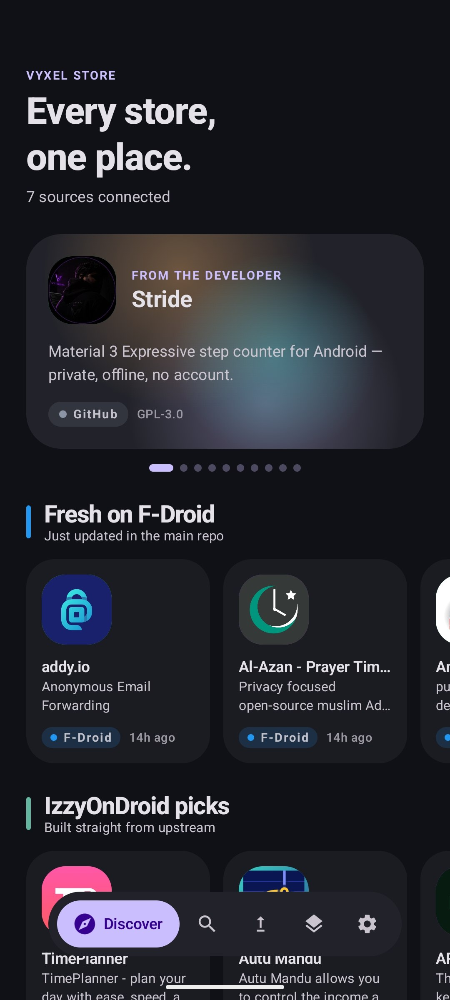
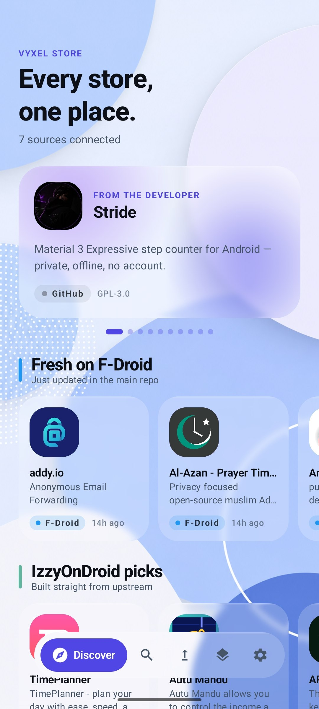
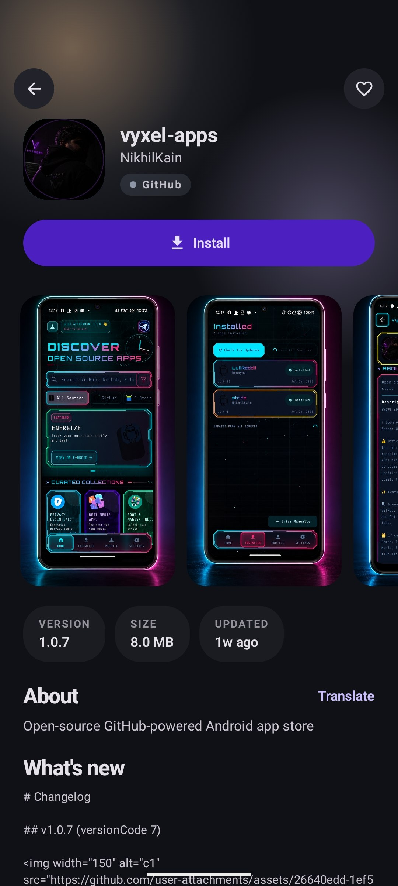

<a id="top"></a>
<div align="center">


# APPSTORE

<sub>Derived from the open-source Vyxel Apps client by NikhilKain (AGPL-3.0); see <a href="NOTICE">NOTICE</a>. The store name shown in the app is set per tenant, not hardcoded.</sub>


[](LICENSE)
[](https://github.com/Zapier-codes/Storeapp/releases)
[](https://github.com/Zapier-codes/Storeapp/stargazers)
[](https://kotlinlang.org)
[](#)

[**⬇ Download APK**](https://github.com/Zapier-codes/Storeapp/releases/latest) &nbsp;·&nbsp; [**🌐 Website**](https://github.com/Zapier-codes/Storeapp) &nbsp;·&nbsp; [**🐛 Report Bug**](https://github.com/Zapier-codes/Storeapp/issues)

<br/>

[](#whats-new)
[](#features)
[](#themes)
[](#screenshots)
[](#installation)
[](#tech-stack)
[](#support)

</div>

---

> ⚠️ **Where to get it**
> Download Appstore from this repository's [Releases](https://github.com/Zapier-codes/Storeapp/releases)
> or from the Zealot-hosted website. APKs from anywhere else are unofficial and may be tampered with.
> Always verify the signature (see [Installation](#installation)).

<a id="whats-new"></a>
## 🆕 What's new

- **A new look.** New app icon (a glossy four-colour glass triangle on black, the one on your launcher), a new launch splash that types the name **Appstore** out under the icon, and a **2026 home**: a full-bleed hero carousel, image-tile collections and a flat "Recommended for you" list. The old first-run GitHub-token page is gone; the token is an optional setting and Home works without it.
- **Every theme is free.** Liquid Glass Dark and Light, Cyberpunk and Neon Punk sit beside Light, Dark, Minimal, AMOLED, Sunset and Custom, with no key, payment or network check. See [Themes](#themes).
- **Two interfaces.** The classic four-tab dock, or the Expressive shell with five tabs (Home, Search, Updates, Sources, Settings). Switch in Settings.
- **Zealot first.** The signed Zealot catalog is the first source in both interfaces, and every download is checked (SHA-256 and signing certificate) before it installs. D-Store is browse-only.
- **It updates itself.** The store checks the signed index, downloads its own update in the app, verifies it, and installs it through a `PackageInstaller` session, with Install, Retry and Cancel on the banner.
- **Play-style listings.** Badges, a rating line, per-app auto-update, pre-register, Data Safety, reviews, a developer page, a similar-apps rail, and search sort and filters. A rating or review only appears when the publisher supplies one; nothing is invented. See [docs/PLAY-PARITY.md](docs/PLAY-PARITY.md).
- **Update ownership on Android 14+.** Apps installed here ask Android to make this store their update owner, so another installer needs your confirmation to replace them. Best effort; an install never fails on it.

Build status, per-leaf notes and what has and has not been tested on a device are in [HANDOVER.md](HANDOVER.md).

<a id="features"></a>
## ✨ Features

<table>
<tr>
<td width="50%" valign="top">

**🔍 Many sources, one store**
Zealot (first), F-Droid, IzzyOnDroid, GitHub, GitLab, Codeberg, Aptoide, APKPure, Aurora OSS, Flathub and WinGet, plus root-module repositories, merged into a single feed. D-Store is browse-only.

**📴 Works offline**
Source lists are kept on the phone. Browse and search with no connection; online, search answers from disk before the network does.

**🛡 Verification before every install**
A downloaded file is checked against the index's SHA-256 and signing fingerprint, and against the installed app's signing certificate, before it installs. A hijacked repo or redirected release cannot silently overwrite what is on your phone.

**🔄 Self-update**
The store updates itself in place, with a banner for Update available, Downloading, Verifying, Ready to install and Failed (Retry).

**🥷 Optional silent installs**
Shizuku and root installs, behind Settings and off by default. Every install still goes through the same verification.

**🔔 Background update monitoring**
WorkManager checks installed apps against every source. Switch auto-update off per app and it raises no notification.

</td>
<td width="50%" valign="top">

**🏪 Play-style app pages**
Badges, rating line, Data Safety, reviews, trailer link, developer page, similar apps, pre-register.

**🔎 Search that you can steer**
Sort and filter the results in both interfaces.

**📱 Today widget**
App of the Day and your pending update count, refreshed every 30 minutes.

**⬇️ Download APK**
Save any app's file to Downloads instead of installing it; split installs are saved as the whole set.

**🔄 Install history and rollback**
Roll back to a previous version from your install history.

**🌍 16 languages**
English, Hindi, Spanish, French, German, Japanese, Portuguese, Italian, Russian, Chinese, Korean, Arabic, Dutch, Turkish, Polish, Swedish.

**📢 In-app announcements**
Dismissible banners for releases and community updates.

</td>
</tr>
</table>

<a id="themes"></a>
## 🎨 Themes

All free, all selectable in **Settings** with no key, payment or network check:

**Light · Dark · Minimal · AMOLED · Sunset · Custom · Liquid Glass Dark · Liquid Glass Light · Cyberpunk · Neon Punk**

The two Liquid Glass looks and the Cyberpunk and Neon Punk looks currently use the stock dark and light palettes underneath; their branded palettes and a real glass blur are original work still to come (leaf `j.xi` in [HANDOVER.md](HANDOVER.md)). The Expressive shell also has a skin picker; it ships the Default skin for now.

<a id="open-source"></a>
## 🧩 Open source

Everything in this repository is AGPL-3.0, with nothing behind a paywall: sources, search and merge, downloads, verification, installs, update scanning, rollback, the Modules screen, both interfaces and every theme. Anyone using a build over a network is entitled to its source; this repository is that source.

This app is derived from [Vyxel Apps](https://github.com/NikhilKain/vyxel-apps) by NikhilKain. The upstream copyright line is kept, as the licence requires. Our version numbers are our own (`1.1.x`, from `version.properties`) and are unrelated to upstream's tags; the application id is the same as upstream's, so a phone holds one or the other, and an update across the two needs the same signing key.

<a id="screenshots"></a>
## 📱 Screenshots

<div align="center">

> These screenshots were taken before the new home, splash and themes and will be replaced.

   

*Home ·*

   

*Home · Apps · Profile · Settings*

   

*Home · Apps · Profile · Settings*

   

</div>

<a id="installation"></a>
## 📥 Installation

1. Download the latest APK from [Releases](https://github.com/Zapier-codes/Storeapp/releases/latest)
2. On your Android device: **Settings → Apps → Special access → Install unknown apps** → enable for your browser/file manager
3. Tap the downloaded APK to install. On Android 8+ the "Install unknown apps" switch is per app, so it is the browser or file manager you switch on.

To check a build: `apksigner verify --print-certs app-release.apk`.

> 💡 Optional: install [Shizuku](https://shizuku.rikka.app/) for silent, confirmation-free installs of every app you update through Appstore.

<details>
<summary><b>🔧 Building from Source</b></summary>
<br/>

```bash
git clone https://github.com/Zapier-codes/Storeapp.git
cd Storeapp
```

Open the project in Android Studio (JDK 17, compileSdk 37, targetSdk 36, minSdk 26) or build from the command line:

```bash
./gradlew :app:assembleDefaultDebug
```

Release signing keys and the push and tenant settings are optional and only needed to reproduce production behaviour; without them you get an unsigned release build, push disabled and the default store. Versioning and the release pipeline are described in [docs/RELEASING.md](docs/RELEASING.md).

</details>

<a id="tech-stack"></a>
## 🛠 Tech Stack

<div align="center">


</div>

- [Kotlin](https://kotlinlang.org/) + [Jetpack Compose](https://developer.android.com/jetpack/compose) + [Material 3](https://m3.material.io/)
- [Retrofit](https://square.github.io/retrofit/) + [OkHttp](https://square.github.io/okhttp/) — GitHub / GitLab / F-Droid / IzzyOnDroid / APKPure / Aptoide clients
- [Coil](https://coil-kt.github.io/coil/) — image loading
- [WorkManager](https://developer.android.com/topic/libraries/architecture/workmanager) — background update checks and the daily offline sync
- SQLite with FTS4 — the offline catalogue and its instant search
- [Shizuku](https://shizuku.rikka.app/) — silent installs without root
- [AndroidX Security Crypto](https://developer.android.com/jetpack/androidx/releases/security) — encrypted storage for tokens
- [Backdrop](https://github.com/Kyant0/Backdrop) — blur for the glass looks

<a id="contributing"></a>
## 🤝 Contributing

Contributions are welcome! Open an issue first to discuss what you'd like to change.

1. Fork the repo
2. Create a feature branch (`git checkout -b feature/cool-thing`)
3. Commit your changes (`git commit -m 'Add cool thing'`)
4. Push to the branch (`git push origin feature/cool-thing`)
5. Open a Pull Request

<a id="support"></a>
## 💖 Support

- ⭐ Star this repo
- 🐛 Report bugs in [Issues](https://github.com/Zapier-codes/Storeapp/issues)
- 📝 Send feedback via the in-app feedback button

Upstream's own funding links belong to its author and are not ours, so they are not listed here.

## 📄 License

[](LICENSE)

<br/>

<div align="center">


Built for the open-source community.

[⬆ Back to top](#top)

</div>
